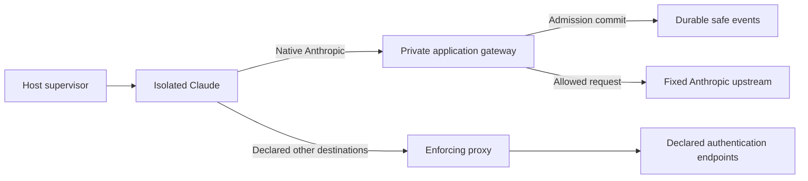

# Architecture

`plan.md` is the approved architecture. T01 foundation, T02 isolation and T03 first native gateway are implemented. Shared serialized contracts remain schema 1; enforcement belongs to runtime, gateway and policy modules.

The host CLI alone controls Docker. Adapters describe agent configuration. Runtime validates the selected workspace, creates trusted identity, selects a free internal subnet, reserves dedicated provider state, enforces limits and owns lifecycle/cleanup. No container receives the Docker socket. Per-session labels identify ephemeral containers, networks and CA volumes.

In `APPLICATION_GATEWAY`, the agent joins only the internal network. Proxy and gateway also join upstream. The gateway has a designated internal IPv4 address at subnet index 3 and port 8000; proxy uses index 2 and port 8080. Neither publishes a host port. Default-deny agent rules admit only designated infrastructure TCP sockets, required TCP loopback and replies. DNS, direct internet, UDP, IPv6 and host/sibling access remain denied. Compose health plus bootstrap readiness prevent a workload from starting without its gateway; there is no route fallback.

The supervisor supplies a cryptographically random opaque token in existing `AgentSession.session_token`, excluded from shared serialization/repr. A minimal ephemeral mode-0400 file supplies trusted session, agent, adapter, user/profile, expiry and token to the gateway read-only. The agent supplies the token in `X-AICtrl-Session`; constant-time equality, a single header and expiry are checked. Native client session headers never determine trusted control identity. The internal header is stripped before upstream forwarding and is absent from audit/logging.

Claude retains subscription state in `aictrl-claude-state`. Only `ANTHROPIC_BASE_URL`, internal custom headers and network settings are added; no gateway API credential replaces saved provider authentication. Native authorization and Anthropic version/beta headers pass through. The behavior was verified against [Claude gateway configuration](https://code.claude.com/docs/en/llm-gateway) and by the live T03 subscription response.

The gateway is the same Python modular monolith packaged as a separate FastAPI/uvicorn service. It runs as the host's non-root UID/GID, with all capabilities dropped, no-new-privileges, read-only root, bounded tmpfs/resources and no socket/workspace/provider-state/CA-private mount. Its production mounts are trusted session (read-only), policy (read-only) and audit directory (read-write). Agents receive only selected workspace, dedicated provider state and public CA.

POST `/anthropic/v1/messages` and `/anthropic/v1/messages/count_tokens` map to fixed HTTPS Anthropic paths. Query bytes and original native JSON bytes are preserved. Caller upstream URLs and Host headers cannot choose a destination. Hop headers and Connection-nominated fields are removed; future `anthropic-*` and relevant native client headers are preserved. One lifecycle-owned HTTPX client has explicit timeouts/connection limits, `trust_env=False`, no redirect following and no POST retry. Upstream status, raw error bytes and end-to-end headers are preserved. Raw SSE is yielded incrementally, including pings and terminal events; no complete-stream parsing or semantic guards are added. See [native protocol requirements](https://code.claude.com/docs/en/llm-gateway-protocol).

Admission builds existing `ControlRequest` and `PolicyContext` contracts from trusted identity and a supported native operation. Strict `config/policy.yaml` defaults to BLOCK and enables only explicit declared operations for an enabled agent. Invalid identity/body, denied/disabled policy, unsupported operation and policy exceptions block before upstream. The bounded body is validated in memory, without persisting content.

Standard-library SQLite stores a 14-column `events` table plus typed schema-1 `SecurityEvent` JSON and session index. `.aictrl/audit/events.sqlite3` lives in the protected host control directory, outside workspace/state/session cleanup. WAL and synchronous FULL transactions commit ALLOW admission before `client.send`; write failure prevents the upstream action. Durable BLOCK decisions have stable reasons. Completion/failure is a correlated AUDIT event. If a final write fails after bytes were sent, it logs only safe session/request identifiers; delivered bytes cannot be recalled. Events contain no prompts, tool arguments, credentials or internal tokens. The host CLI can display safe per-session events.

The generic proxy cannot forward inference in gateway mode: every declaration sharing an INFERENCE host is removed, and inference-host test pins are refused. Exact authentication endpoints remain available. `EGRESS_ONLY` retains native provider destinations through opaque CONNECT and destination/port coverage only, without application admission. Its deterministic qualification explicitly selects that mode. CA private material remains proxy-only.

Existing native status/login, onboarding preparation, workspace validation, complete capability drop, state reservation and one monotonic host deadline are preserved. Cleanup deletes ephemeral identity/infrastructure and preserves workspace, native provider state and durable events. Restrict/terminate hooks remain available for later response logic.

T03 covers native admission, transparent forwarding and durable attribution. It does not implement model usage extraction, output inspection, semantic guards, MCP, budgets, reload, dashboard or a second adapter. T04 starts with the required real-agent allowed/denied/bypass integration proof, reusing this path.
