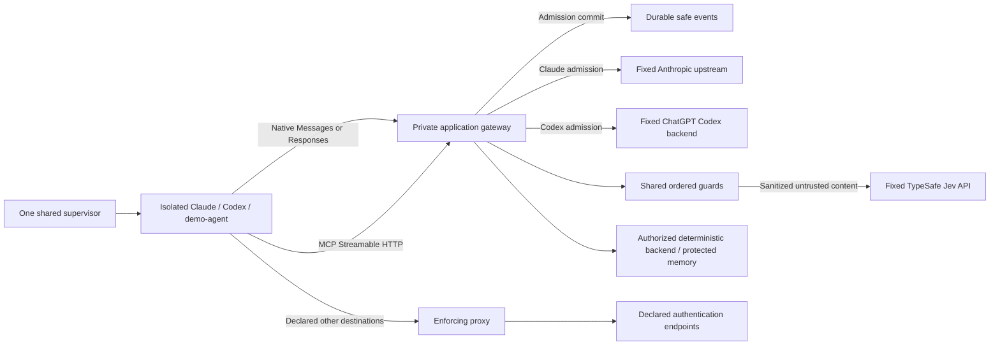
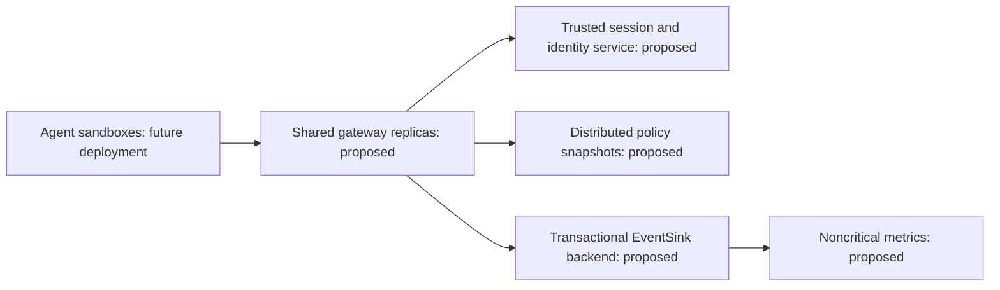

# Architecture

`plan.md`, including its approved T06 amendment, is the architecture source. T01–T05/T05H are complete. T06 adds ordered guards, external Jev, native output inspection and SDK v2 MCP authorization; external live qualification is tracked separately in `docs/T06_REPORT.md`. Shared serialized contracts remain unchanged schema 1; policy configuration is schema 3/version `t06`. Enforcement belongs to runtime, gateway, guards and policy modules.

The host CLI alone controls Docker. `runtime/registry.py` contains an immutable code-owned map of `RuntimeAgentSpec` factories, trusted configuration accessors, authentication checks, login hints and gateway requirements. Unknown/unconfigured agents fail before launch. Adapters describe protocol, billing mode, image, native entry/prompt/smoke commands, dedicated state and provider endpoints. `run_agent()` resolves a spec without provider branches. Runtime validates the selected workspace, creates trusted identity, selects a free internal subnet, reserves dedicated provider state, enforces limits and owns lifecycle/cleanup. No container receives the Docker socket. Per-session labels identify ephemeral containers, networks and CA volumes.

In `APPLICATION_GATEWAY`, the agent joins only the internal network. Proxy and gateway also join upstream. The gateway has a designated internal IPv4 address at subnet index 3 and port 8000; proxy uses index 2 and port 8080. Neither publishes a host port. Default-deny agent rules admit only designated infrastructure TCP sockets, required TCP loopback and replies. DNS, direct internet, UDP, IPv6 and host/sibling access remain denied. Compose health plus bootstrap readiness prevent a workload from starting without its gateway; there is no route fallback.

The supervisor supplies a cryptographically random opaque token in existing `AgentSession.session_token`, excluded from shared serialization/repr. RuntimeSupervisor creates exactly one authoritative AgentSession and token, then calls the supplied adapter’s render_config exactly once. A minimal ephemeral mode-0400 file supplies trusted session, agent, adapter, protocol, user/profile, expiry and token to the gateway read-only. The agent supplies the token in `X-AICtrl-Session`; constant-time equality, a single header and expiry are checked. Native client session headers never determine trusted control identity. The internal header is stripped before upstream forwarding and is absent from audit/logging.

Claude retains subscription state in `aictrl-claude-state`. Only `ANTHROPIC_BASE_URL`, internal custom headers and network settings are added; no gateway API credential replaces saved provider authentication. Native authorization and Anthropic version/beta headers pass through. The behavior was verified against [Claude gateway configuration](https://code.claude.com/docs/en/llm-gateway) and by the live T03 subscription response.

CodexAdapter supplies RESPONSES/SUBSCRIPTION and the pinned official 0.159.3 image. Its state is exclusively `aictrl-codex-state` at `/home/dev/.codex`. Trusted bootstrap selects exactly the Claude or Codex state path, without accepting an arbitrary provider mount. Compose renders one generic external `provider-state` volume from trusted adapter metadata. Validation permits a named volume and one absolute `/home/dev/.provider` directory, rejecting bind syntax, host paths, traversal, wildcards and nested/symlink path selectors. Production paths still come exclusively from reviewed adapter code; configuration cannot register a path or executable. A stable volume-derived engine lease preserves the existing authentication reservation names and prevents duplicate provider/authentication sessions while allowing independent Claude/Codex preparations. The bootstrap and native authentication allowlists intentionally remain explicit reviewed extension points for actual new providers. Native status uses a recreated, network-none container and read-only state; restricted device login admits only auth.openai.com. Provider files are never parsed by the control layer or copied from the host.

The public Codex profile at `$CODEX_HOME/aictrl.config.toml`, selected using `--profile aictrl`, uses saved ChatGPT authentication, `http://gateway:8000/codex`, Responses HTTP/SSE, disabled WebSockets and zero transport retries. `env_http_headers` obtains internal identity from `AICTRL_SESSION_TOKEN`; the profile contains no session secret. Codex exec input stays on stdin, history persistence is disabled, logs use tmpfs and native stderr is suppressed in prompt mode because it includes full input.

The agent is untrusted; AICTRL's Docker boundary enforces its filesystem access, UID/capabilities, network and resource limits. The packaged Codex profile disables only the inner native sandbox with danger-full-access, approval never and web search disabled. No host/user namespace, seccomp, AppArmor, capability, firewall or mount change is made. Native filesystem/shell tools execute as the same non-root container process; T06 inspects their returned content before a model follow-up. Independent pre-execution tool authorization applies to gateway-mediated MCP operations. Native shell/filesystem execution is still controlled by Docker, rather than intercepted as MCP.

The gateway is the same Python modular monolith packaged as a separate FastAPI/uvicorn service. It runs as the host's non-root UID/GID, with all capabilities dropped, no-new-privileges, read-only root, bounded tmpfs/resources and no socket/workspace/provider-state/CA-private mount. Its production mounts are trusted session (read-only), policy (read-only), audit directory (read-write), and optionally the gateway-only Jev key file (read-only). Native agents receive only selected workspace, dedicated provider state and public CA; the stateless demo omits provider state entirely.

POST `/anthropic/v1/messages` and `/anthropic/v1/messages/count_tokens` map to fixed HTTPS Anthropic paths. Query bytes and safe original native JSON bytes are preserved; only actual input redaction triggers JSON serialization. Caller upstream URLs and Host headers cannot choose a destination. Hop headers and Connection-nominated fields are removed; future `anthropic-*` and relevant native client headers are preserved. One lifecycle-owned HTTPX client has explicit timeouts/connection limits, `trust_env=False`, no redirect following and no POST retry. Checked safe response units retain original SSE bytes, pings and ordering; unsafe units are withheld. Non-SSE JSON is bounded and checked before release. Content-Length is removed because an output block may end a stream early, and opaque compressed output fails closed. See [native protocol requirements](https://code.claude.com/docs/en/llm-gateway-protocol).

The immutable `gateway/registry.py` selects a native handler using required trusted `GatewaySession.protocol`, independently of agent brand. Invalid/unsupported protocols fail startup; explicit null selects a deny-all LLM handler for stateless MCP sessions. Agent/adapter identity consistency is validated separately. Multiple reviewed adapters may reuse an existing protocol. Independent `AnthropicMessagesHandler` and `ResponsesHandler` implement the `NativeProtocolHandler` contract in `gateway/protocols.py`; neither inherits the other. Responses admits only POST `/codex/responses`, forwarding to fixed `https://chatgpt.com/backend-api/codex/responses`. This native subscription origin was explicitly approved after the original API origin returned 401. There is no caller/environment origin selector or fallback. Provider Authorization and ChatGPT-Account-ID plus relevant native client headers pass through; all internal/hop headers are stripped. Native function calls, matching results and subsequent requests remain Responses, without translation. Bounded terminal observers recognize released `message_stop`/`response.completed` evidence; incomplete/error streams and withheld output cannot receive a successful completion event.

Admission builds existing `ControlRequest` and `PolicyContext` contracts from trusted identity and a supported native operation. Strict `config/policy.yaml` defaults to BLOCK and enables only explicit declared operations for an enabled agent. Invalid identity/body, denied/disabled policy, unsupported operation and policy exceptions block before upstream. The bounded body is validated in memory, without persisting content.

Policy configuration is schema 3, policy version `t06`. Each enabled agent has exact rules containing a unique ID, channel, direction, nullable protocol, target, nonempty operations and ALLOW/BLOCK action, with STRUCTURED inspection as the default. PolicyEngine checks session/policy-version consistency and scans only that agent’s rules: matching BLOCK wins, otherwise matching ALLOW wins, otherwise BLOCK. Every dimension, including inspection coverage, must match; disabled/unknown agents and wrong target/operation/protocol remain BLOCK. Unknown fields/enums, wildcard identifiers and globally duplicate rule IDs are rejected. Schemas 1/2 receive explicit migration errors; schema 3 adds validated guard/privacy settings. Shared serialized contracts/events remain unchanged schema 1. Shipped rules admit native Claude/Codex operations and explicit demo MCP tools/resources without provider branches in PolicyEngine. Codex catalog/auxiliary routes remain denied.

`gateway/control.py` owns one ControlPipeline: identity → exact policy → bounded native parsing/extraction → shared input guards → optional durable REDACT → durable ALLOW → one upstream send → guarded output units → correlated final audit. Protocol handlers own paths/origins, headers, payload provenance, output framing and terminal evidence. Safe requests remain byte-identical. Redaction changes only selected string fields and keeps tool IDs, unrelated fields and native protocol structure. Unsupported handler operations are blocked even if policy attempts to allow them.

ControlPipeline depends on `reporting/sink.py`’s minimal EventSink protocol. append(SecurityEvent) must return only after durable commit or raise StoreFailure; the current EventStore satisfies it structurally. Host query/reporting code continues to use EventStore. Standard-library SQLite stores a 14-column `events` table plus typed schema-1 `SecurityEvent` JSON and session index. `.aictrl/audit/events.sqlite3` lives in the protected host control directory, outside workspace/state/session cleanup. WAL and synchronous FULL transactions commit ALLOW admission before `client.send`; write failure prevents the upstream action. Durable BLOCK decisions have stable reasons. Completion/failure is a correlated AUDIT event. If a final write fails after bytes were sent, it logs only safe session/request identifiers; delivered bytes cannot be recalled. Events contain no prompts, tool arguments, credentials or internal tokens. The host CLI can display safe per-session events. Security-critical admission/BLOCK writes remain synchronous and awaited, despite running outside the event loop in worker threads. They must never become a fire-and-forget queue. A future backend may implement the same durability guarantee; separate noncritical counters, dashboard telemetry and latency samples could later be batched asynchronously. No batching/backend replacement is implemented.

The generic proxy cannot forward inference in gateway mode: every declaration sharing an INFERENCE host is removed, and inference-host test pins are refused. Claude excludes api.anthropic.com; Codex excludes both api.openai.com and chatgpt.com. Exact authentication endpoints remain available. `EGRESS_ONLY` retains Claude's destination/port coverage without application admission; the Codex launcher requires APPLICATION_GATEWAY. CA private material remains proxy-only.

Existing native status/login, onboarding preparation, workspace validation, complete capability drop, state reservation and one monotonic host deadline are preserved. Cleanup deletes ephemeral identity/infrastructure and preserves workspace, native provider state and durable events. Restrict/terminate hooks remain available for later response logic.

T01–T05/T05H historical qualification remains recorded in NOTES.md. T06 guard/MCP qualification and its external-provider limitations are separate in `docs/T06_REPORT.md`. Native provider token accounting, budgets, approvals, reload, risk response and dashboard remain future work.

## Extending the modular monolith

An offline test (`tests/unit/test_architecture.py`) installs a synthetic trusted third RuntimeAgentSpec/adapter and a policy rule, reuses the existing ResponsesHandler, and checks one session/config, Compose state, internal token propagation/stripping, durable pre-upstream admission, correlated completion/BLOCK and cleanup. This fixture adds no production CLI/image/auth flow. Its extension does not edit RuntimeSupervisor, PolicyEngine or ControlPipeline. An actual third provider still needs reviewed image/bootstrap/auth/config bindings; untrusted Python plugins and arbitrary state/upstream selectors are deliberately absent.

A new LLM transport implements NativeProtocolHandler and is explicitly registered, reusing ControlPipeline and EventSink. MCP has its own official SDK transport and MCPControlService, sharing the exact PolicyEngine, GuardEngine, GatewaySession and EventRecorder/EventSink boundary. Existing `Channel.MCP` and nullable `ControlRequest.protocol` accurately express MCP without adding a fake LLM protocol or changing shared enums.

## T06 guards, external semantic control and output

InspectionSegment is an ephemeral RAM-only view: text, native JSON path, source/provenance, mutability and whether content is untrusted external data. It is not a shared contract or audit payload. Anthropic extracts system/messages/text/tool-use arguments/tool results; Responses extracts instructions, input messages, function/custom-tool arguments and returned output. Recursive extraction is bounded and rejects duplicate JSON keys and nonfinite constants. Decoded serialized arguments and immutable keys are also checked; content that cannot safely be rewritten is blocked.

GuardEngine runs stable secret signatures first, then selected Presidio EMAIL_ADDRESS/PHONE_NUMBER/CREDIT_CARD recognizers, then external semantics only for marked untrusted content. Secret signatures cover PEM private-key headers, AWS-style IDs, OpenAI/Anthropic/GitHub tokens, conservative Bearer tokens and `AICTRL_SECRET_` demo markers. Email uses Presidio's pattern directly to avoid its remote public-suffix lookup; phone uses bounded selected regions and cards require Luhn validation. No AnalyzerEngine/NLP pipeline or language model is instantiated/downloaded. Overlaps resolve deterministically and replacements apply in reverse offset order. Input PII is redacted with typed markers; output PII is blocked. Combined decisions use BLOCK > REQUIRE_APPROVAL > REDACT > ALLOW; T06 implements no approvals.

JevSemanticProvider implements a narrow SemanticDecisionProvider interface. The fixed endpoint is `https://api.typesafe.ai/v1/systemone`, verified against the [official OpenAPI schema](https://api.typesafe.ai/openapi.json). One `jev-latest` request contains named `noul` questions for prompt_injection, data_exfiltration and security_bypass. Each threshold defaults to 0.85 inclusive. Text above 32768 characters or 256 segments is blocked without truncation; the end-to-end deadline is 2500 ms. Strict parsing requires exactly the expected finite numeric answers, response model and token usage. HTTP/auth/quota/redirect/timeout/invalid/oversize responses block, with no retries or fallback. Direct user/system text and ordinary native model output cause zero semantic calls. Known secrets prevent the call and identified PII is removed beforehand; residual unrecognized sensitive data in tool results can still reach the approved external service. This is an explicit privacy/availability change from the original local-model plan.

Host input `AICTRL_JEV_API_KEY` is validated and staged into the mode-0700 session directory as a mode-0400 file. Compose receives only the path, mounting it at `/run/secrets/aictrl/jev_api_key` in the gateway read-only. The value is never placed in container environment, manifest, agent/proxy, workspace, policy, SQLite or logs. Cleanup removes the staged file. Missing key keeps health available for deterministic-only operations, while semantic-required requests/results fail closed. A separate lifecycle-owned HTTPX client has fixed origin, explicit timeouts, `trust_env=False`, zero retries and no redirects. Tests inject a named fake; production factory always uses Jev.

Native SSE buffering waits for an Anthropic content block or a Responses output item, including complete tool arguments. Interleaved items become one ordered group until all active items close. Raw frames, pings, initial/final snapshots, decoded JSON arguments and concatenated deltas are inspected before release. Defaults are 1 MiB per buffered unit/group and 30 seconds, including heartbeat traffic; malformed, oversized, timed-out or incomplete units are withheld. Safe units retain original bytes and order. Native outputs use deterministic secret/PII guards; semantic inspection occurs when untrusted tool output returns in a later input. Output blocks produce durable BLOCK plus `llm.output_blocked` AUDIT after admission, with no successful completion. Already released safe units cannot be recalled. Per-unit inspection does not prove detection of a value deliberately divided across independently completed units, or encoded/image/binary data outside the text coverage.

## T06 MCP and stateless demo

The pinned official MCP SDK 2.3.0 provides native Streamable HTTP at `/mcp`, with stateless JSON responses, 1 MiB requests, DNS-rebinding protection and lifecycle-managed transport. A pre-SDK identity boundary validates exactly one session header and expiry. Tool/resource discovery is policy-filtered; every guessed name/URI receives independent exact authorization. Backend dispatch requires successful argument secret/PII guards and durable REDACT/ALLOW writes. A blocked destructive call never invokes the backend. Returned text receives output secret/PII and untrusted-content Jev checks before SDK delivery; blocked results record BLOCK and `mcp.result_blocked`, never `mcp.backend_completed`. Safe fixed errors omit raw backend exceptions.

The local deterministic backend defines safe_lookup, echo_contact, poisoned_document and destructive_delete_all. Only the first three are discoverable/allowed for demo-agent; the last only increments a counter if invoked and performs no destructive operation. `memory://project/demo` is visible/allowed. `memory://private/demo` is synthetic gateway-only memory, hidden and independently denied even when its URI is guessed. This demonstrates authorization over a trusted demo backend, not arbitrary enterprise MCP federation or durable memory storage.

DemoAgentAdapter is registered through trusted RuntimeAgentSpec metadata with explicit stateless=True. Runtime and Compose require both state volume and mount to be absent; native adapters still require their dedicated state and stable leases. The demo mounts only workspace/public CA and needs no authentication or LLM. Its SDK client performs discovery, safe lookup, forbidden guess/counter check, PII redaction, secret block, protected-memory checks and poisoned-result withholding. An empty proxy destination list is valid deny-all and rejects before DNS. The demo image copies the qualified firewall/readiness script and preserves inherited MIT notices, UID/capability/NNP/limits and cleanup. Its shared AgentSession retains legacy LOCAL/CHAT_COMPLETIONS metadata for schema-1 compatibility; the trusted GatewaySession is explicitly null protocol and denies all native LLM routes.

`make verify-demo-boundary` uses an explicitly labelled offline semantic fixture and a synthetic staging key to qualify Docker mounts and attacks without live Jev calls. `aictrl run demo-agent demo/project` uses production Jev and reports PARTIAL when the key is unavailable; fixture PASS is never reported as live semantic qualification.

## T07 insertion points

T07 is TODO. Add atomic budget reservation in ControlPipeline after input guards/REDACT and before durable ALLOW/send; settle actual native usage and failure/cancellation with correlated requests. MCP request-bound expiring approvals and budget reservation enter after authorization/argument guards and before ALLOW/backend dispatch. Resource reads need the same governance reservation. Replace the static policy snapshot with validated, atomic, versioned policy/threat-feed reload and implement runaway limits. No T06 REQUIRE_APPROVAL result is granted execution. Dashboard/risk/local-alert response remains T08.

## Local performance measurement

`make benchmark-gateway` measures actual loopback HTTP against a short deterministic synthetic SSE upstream, without provider/LLM/Jev traffic or artificial provider delay. It compares direct forwarding with the complete gateway/policy/durable ALLOW/stream/durable AUDIT path. Original request/response bytes are identical; the benchmark-only transport asserts the fixed production URL and stripped identity before connecting to loopback. Production has no upstream override. Each load cohort starts with a fresh downstream pool and a three-request warm-up; the gateway retains its production 20/10 upstream connection limits. p50/p95/p99 use nearest rank and perf_counter_ns and include stream completion/commit, not just first byte. No CI timing thresholds are added.

Measured 2026-10-03 20:34:45 UTC on Python 3.12.15, Linux 7.0.0-34 x86_64/glibc 2.43, Intel i7-10750H @ 2.60 GHz, 12 logical CPUs. SQLite files used this checkout’s `.aictrl/benchmarks` directory with WAL/FULL. Client, synthetic server and gateway share one Python process/event loop; this is a local application-layer measurement without TLS, Docker networking or provider latency, not an enterprise/cloud benchmark.

| Path | Concurrency | Requests / failures | p50 / p95 / p99 (ms) | Successful requests/s |
|---|---:|---:|---|---:|
| Direct | 1 | 500 / 0 | 2.029 / 3.005 / 3.354 | 461.194 |
| Gateway | 1 | 500 / 0 | 10.492 / 11.707 / 13.553 | 94.263 |
| Direct | 10 | 500 / 0 | 19.612 / 23.485 / 42.028 | 481.954 |
| Gateway | 10 | 500 / 0 | 54.882 / 72.378 / 103.500 | 175.534 |
| Direct | 50 | 500 / 0 | 96.106 / 650.011 / 1039.039 | 244.193 |
| Gateway | 50 | 500 / 0 | 395.450 / 1291.600 / 2161.422 | 93.524 |

Policy-only (100,000 decisions): p50/p95/p99 **5.496 / 9.370 / 10.396 µs**. SQLite durable append (300 writes, including event serialization/connection/commit): **2.461 / 2.753 / 3.281 ms**. In-path append p50/p95/p99 were 2.664/3.058/3.874 ms at concurrency 1, 3.587/10.173/35.962 at 10 and 4.663/11.981/36.826 at 50. All 1509 gateway requests including warm-ups retained paired durable admission/completion; the internal token was absent from the database. JSON is saved to ignored `.aictrl/benchmarks/latest.json`.

Durable writes are a substantial measured cost compared with policy; two commits plus the extra HTTP hop explain much of the sequential path. At 50, event-loop/client/pool scheduling and local SQLite contention produce a long tail; the direct baseline already has a long tail, so it cannot all be attributed to SQLite or protocol handling. These numbers are separate cohorts, not a fabricated subtraction of live provider latency. No durability, firewall or production transport setting was relaxed for performance.

The initial benchmark listener used socket proto=0, which skipped asyncio’s TCP_NODELAY setup and added roughly 40 ms delayed ACK. Only this fixture was corrected to IPPROTO_TCP. A subsequent shared-client-cohort run reported one transport failure at 50; fresh per-cohort downstream pools remove cross-phase idle connections. These diagnostic results are recorded in NOTES.md; no retry was added or failed sample silently counted as success.

## Scalability model

Current deployment uses one local Docker host supervisor and one agent, gateway, proxy and private network per session, plus a dedicated provider-state named volume and local SQLite audit. One active lease per provider-state identity is required. SQLite serializes writers; no distributed session registry, horizontal orchestration or multiplexed shared gateway exists. This intentionally favors isolation, simple failure domains and demo reliability over density for thousands of agents.

A possible enterprise deployment would use stateless shared gateway replicas, a trusted distributed session/identity service and policy snapshots/cache, with a transactional event/state backend. Credentials would need protected state per user/principal or a credential broker supplying short-lived tokens, rather than cloning a single native provider volume across concurrent sessions. Tenant isolation, routing, authentication, consistency and failure recovery still require implementation and qualification.

A future Postgres/Kafka-style durable writer could implement EventSink without rewriting admission logic; append would still need acknowledged durability before upstream action. Transport handlers, generic policy and control no longer depend on per-session container orchestration or SQLite queries. These are code boundaries preparing later deployment work, not a claim that distributed services or enterprise-scale throughput exist.

T05H passed 227 offline tests, both focused Docker matrices (47/42), six leases and one real native smoke per provider. Those measurements predate T06 guards. Current T06 implementation and qualification are documented below and in `docs/T06_REPORT.md`. Stop before T07 unless explicitly instructed.
