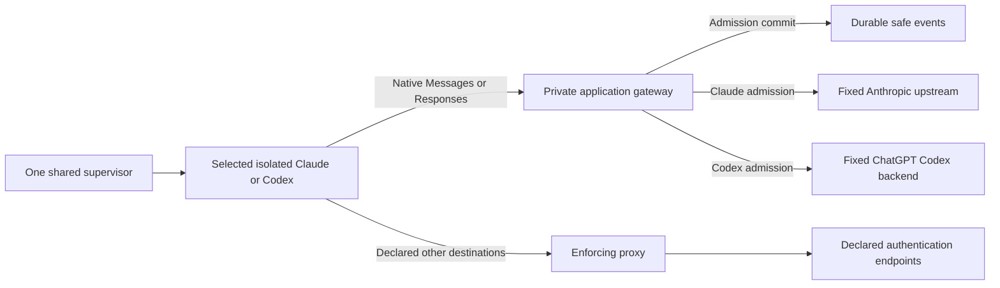

# Architecture

`plan.md` is the approved architecture. T01–T05 are complete, including repeatable Claude proof and the second native Codex Responses adapter. Shared serialized contracts remain schema 1; enforcement belongs to runtime, gateway and policy modules.

The host CLI alone controls Docker. Adapters describe agent configuration. Runtime validates the selected workspace, creates trusted identity, selects a free internal subnet, reserves dedicated provider state, enforces limits and owns lifecycle/cleanup. No container receives the Docker socket. Per-session labels identify ephemeral containers, networks and CA volumes.

In `APPLICATION_GATEWAY`, the agent joins only the internal network. Proxy and gateway also join upstream. The gateway has a designated internal IPv4 address at subnet index 3 and port 8000; proxy uses index 2 and port 8080. Neither publishes a host port. Default-deny agent rules admit only designated infrastructure TCP sockets, required TCP loopback and replies. DNS, direct internet, UDP, IPv6 and host/sibling access remain denied. Compose health plus bootstrap readiness prevent a workload from starting without its gateway; there is no route fallback.

The supervisor supplies a cryptographically random opaque token in existing `AgentSession.session_token`, excluded from shared serialization/repr. A minimal ephemeral mode-0400 file supplies trusted session, agent, adapter, user/profile, expiry and token to the gateway read-only. The agent supplies the token in `X-AICtrl-Session`; constant-time equality, a single header and expiry are checked. Native client session headers never determine trusted control identity. The internal header is stripped before upstream forwarding and is absent from audit/logging.

Claude retains subscription state in `aictrl-claude-state`. Only `ANTHROPIC_BASE_URL`, internal custom headers and network settings are added; no gateway API credential replaces saved provider authentication. Native authorization and Anthropic version/beta headers pass through. The behavior was verified against [Claude gateway configuration](https://code.claude.com/docs/en/llm-gateway) and by the live T03 subscription response.

CodexAdapter supplies RESPONSES/SUBSCRIPTION and the pinned official 0.159.3 image. Its state is exclusively `aictrl-codex-state` at `/home/dev/.codex`. Trusted bootstrap selects exactly the Claude or Codex state path, without accepting an arbitrary provider mount. Independent fixed provider leases prevent duplicate Codex or login sessions while allowing separate Claude/Codex preparations. Native status uses a recreated, network-none container and read-only state; restricted device login admits only auth.openai.com. Provider files are never parsed by the control layer or copied from the host.

The public Codex profile at `$CODEX_HOME/aictrl.config.toml`, selected using `--profile aictrl`, uses saved ChatGPT authentication, `http://gateway:8000/codex`, Responses HTTP/SSE, disabled WebSockets and zero transport retries. `env_http_headers` obtains internal identity from `AICTRL_SESSION_TOKEN`; the profile contains no session secret. Codex exec input stays on stdin, history persistence is disabled, logs use tmpfs and native stderr is suppressed in prompt mode because it includes full input.

The agent is untrusted; AICTRL's Docker boundary enforces its filesystem access, UID/capabilities, network and resource limits. The packaged Codex profile disables only the inner native sandbox with danger-full-access, approval never and web search disabled. No host/user namespace, seccomp, AppArmor, capability, firewall or mount change is made. Native filesystem/shell tools execute as the same non-root container process, while inference remains behind the fixed application gateway. Local tool semantic authorization is deferred to T06.

The gateway is the same Python modular monolith packaged as a separate FastAPI/uvicorn service. It runs as the host's non-root UID/GID, with all capabilities dropped, no-new-privileges, read-only root, bounded tmpfs/resources and no socket/workspace/provider-state/CA-private mount. Its production mounts are trusted session (read-only), policy (read-only) and audit directory (read-write). Agents receive only selected workspace, dedicated provider state and public CA.

POST `/anthropic/v1/messages` and `/anthropic/v1/messages/count_tokens` map to fixed HTTPS Anthropic paths. Query bytes and original native JSON bytes are preserved. Caller upstream URLs and Host headers cannot choose a destination. Hop headers and Connection-nominated fields are removed; future `anthropic-*` and relevant native client headers are preserved. One lifecycle-owned HTTPX client has explicit timeouts/connection limits, `trust_env=False`, no redirect following and no POST retry. Upstream status, raw error bytes and end-to-end headers are preserved. Raw SSE is yielded incrementally, including pings and terminal events; no complete-stream parsing or semantic guards are added. See [native protocol requirements](https://code.claude.com/docs/en/llm-gateway-protocol).

The same gateway pipeline selects ResponsesGateway from trusted session adapter identity and admits only POST `/codex/responses`. It forwards to fixed `https://chatgpt.com/backend-api/codex/responses`. This native subscription origin was explicitly approved by the user after the milestone's original API origin returned 401. There is no caller/environment origin selector or fallback. Provider Authorization and ChatGPT-Account-ID plus relevant native client headers pass through; all internal/hop headers are stripped. Native function calls, matching results and subsequent request bytes remain Responses, without protocol translation. A bounded SSE terminal-frame observer stores only success/failure flags and up to 128 bytes of line prefix. It handles the pinned client's close after response.completed without buffering or persisting response content; native failure/error frames take precedence.

Admission builds existing `ControlRequest` and `PolicyContext` contracts from trusted identity and a supported native operation. Strict `config/policy.yaml` defaults to BLOCK and enables only explicit declared operations for an enabled agent. Invalid identity/body, denied/disabled policy, unsupported operation and policy exceptions block before upstream. The bounded body is validated in memory, without persisting content.

Minimal policy matches Claude to Anthropic messages/count_tokens and Codex to OpenAI Responses. Wrong agent/protocol/target/operation remains BLOCK. Each gateway validates the session's matching adapter/agent before accepting requests. Events remain schema 1; current policy identifier is t03 with the explicit Responses addition. Catalog and auxiliary Codex routes remain denied, and the pinned client completes basic inference with its bundled catalog.

Standard-library SQLite stores a 14-column `events` table plus typed schema-1 `SecurityEvent` JSON and session index. `.aictrl/audit/events.sqlite3` lives in the protected host control directory, outside workspace/state/session cleanup. WAL and synchronous FULL transactions commit ALLOW admission before `client.send`; write failure prevents the upstream action. Durable BLOCK decisions have stable reasons. Completion/failure is a correlated AUDIT event. If a final write fails after bytes were sent, it logs only safe session/request identifiers; delivered bytes cannot be recalled. Events contain no prompts, tool arguments, credentials or internal tokens. The host CLI can display safe per-session events.

The generic proxy cannot forward inference in gateway mode: every declaration sharing an INFERENCE host is removed, and inference-host test pins are refused. Claude excludes api.anthropic.com; Codex excludes both api.openai.com and chatgpt.com. Exact authentication endpoints remain available. `EGRESS_ONLY` retains Claude's destination/port coverage without application admission; the Codex launcher requires APPLICATION_GATEWAY. CA private material remains proxy-only.

Existing native status/login, onboarding preparation, workspace validation, complete capability drop, state reservation and one monotonic host deadline are preserved. Cleanup deletes ephemeral identity/infrastructure and preserves workspace, native provider state and durable events. Restrict/terminate hooks remain available for later response logic.

T05 qualified a real Codex response and durable native Responses completion, 42 focused Docker checks, six provider lease checks, 194 offline tests and one shared-path live Claude regression. Its subsequent profile cleanup passed 13 targeted tests and 20 checks in one real read/create-file/tool-follow-up session, returning AICTRL_CODEX_TOOL_OK. Both native requests have durable admission/completion pairs. External network, credential, UID/capability and cleanup invariants remained green. Model usage extraction, semantic/output guards, MCP authorization, budgets, reload and dashboard remain later milestones. T06 has not started.
