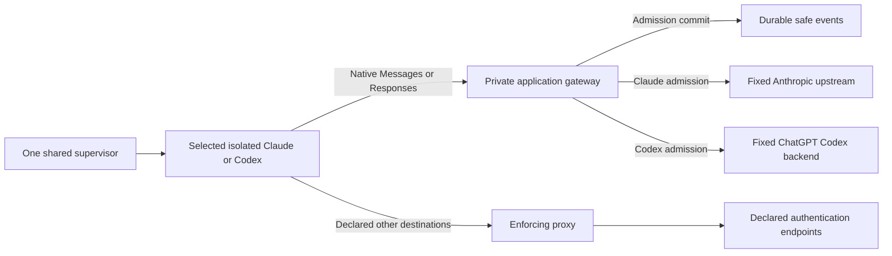
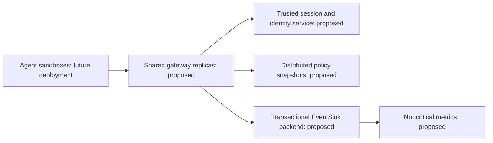

# Architecture

`plan.md` is the approved architecture. T01–T05 are complete. PRE-T06/T05H is COMPLETE and separates runtime configuration, native transport, control decisions and durable writes; qualification is recorded in `NOTES.md`. Shared serialized contracts remain schema 1; enforcement belongs to runtime, gateway and policy modules.

The host CLI alone controls Docker. `runtime/registry.py` contains an immutable code-owned map of `RuntimeAgentSpec` factories, trusted configuration accessors, authentication checks, login hints and gateway requirements. Unknown/unconfigured agents fail before launch. Adapters describe protocol, billing mode, image, native entry/prompt/smoke commands, dedicated state and provider endpoints. `run_agent()` resolves a spec without provider branches. Runtime validates the selected workspace, creates trusted identity, selects a free internal subnet, reserves dedicated provider state, enforces limits and owns lifecycle/cleanup. No container receives the Docker socket. Per-session labels identify ephemeral containers, networks and CA volumes.

In `APPLICATION_GATEWAY`, the agent joins only the internal network. Proxy and gateway also join upstream. The gateway has a designated internal IPv4 address at subnet index 3 and port 8000; proxy uses index 2 and port 8080. Neither publishes a host port. Default-deny agent rules admit only designated infrastructure TCP sockets, required TCP loopback and replies. DNS, direct internet, UDP, IPv6 and host/sibling access remain denied. Compose health plus bootstrap readiness prevent a workload from starting without its gateway; there is no route fallback.

The supervisor supplies a cryptographically random opaque token in existing `AgentSession.session_token`, excluded from shared serialization/repr. RuntimeSupervisor creates exactly one authoritative AgentSession and token, then calls the supplied adapter’s render_config exactly once. A minimal ephemeral mode-0400 file supplies trusted session, agent, adapter, protocol, user/profile, expiry and token to the gateway read-only. The agent supplies the token in `X-AICtrl-Session`; constant-time equality, a single header and expiry are checked. Native client session headers never determine trusted control identity. The internal header is stripped before upstream forwarding and is absent from audit/logging.

Claude retains subscription state in `aictrl-claude-state`. Only `ANTHROPIC_BASE_URL`, internal custom headers and network settings are added; no gateway API credential replaces saved provider authentication. Native authorization and Anthropic version/beta headers pass through. The behavior was verified against [Claude gateway configuration](https://code.claude.com/docs/en/llm-gateway) and by the live T03 subscription response.

CodexAdapter supplies RESPONSES/SUBSCRIPTION and the pinned official 0.159.3 image. Its state is exclusively `aictrl-codex-state` at `/home/dev/.codex`. Trusted bootstrap selects exactly the Claude or Codex state path, without accepting an arbitrary provider mount. Compose renders one generic external `provider-state` volume from trusted adapter metadata. Validation permits a named volume and one absolute `/home/dev/.provider` directory, rejecting bind syntax, host paths, traversal, wildcards and nested/symlink path selectors. Production paths still come exclusively from reviewed adapter code; configuration cannot register a path or executable. A stable volume-derived engine lease preserves the existing authentication reservation names and prevents duplicate provider/authentication sessions while allowing independent Claude/Codex preparations. The bootstrap and native authentication allowlists intentionally remain explicit reviewed extension points for actual new providers. Native status uses a recreated, network-none container and read-only state; restricted device login admits only auth.openai.com. Provider files are never parsed by the control layer or copied from the host.

The public Codex profile at `$CODEX_HOME/aictrl.config.toml`, selected using `--profile aictrl`, uses saved ChatGPT authentication, `http://gateway:8000/codex`, Responses HTTP/SSE, disabled WebSockets and zero transport retries. `env_http_headers` obtains internal identity from `AICTRL_SESSION_TOKEN`; the profile contains no session secret. Codex exec input stays on stdin, history persistence is disabled, logs use tmpfs and native stderr is suppressed in prompt mode because it includes full input.

The agent is untrusted; AICTRL's Docker boundary enforces its filesystem access, UID/capabilities, network and resource limits. The packaged Codex profile disables only the inner native sandbox with danger-full-access, approval never and web search disabled. No host/user namespace, seccomp, AppArmor, capability, firewall or mount change is made. Native filesystem/shell tools execute as the same non-root container process, while inference remains behind the fixed application gateway. Local tool semantic authorization is deferred to T06.

The gateway is the same Python modular monolith packaged as a separate FastAPI/uvicorn service. It runs as the host's non-root UID/GID, with all capabilities dropped, no-new-privileges, read-only root, bounded tmpfs/resources and no socket/workspace/provider-state/CA-private mount. Its production mounts are trusted session (read-only), policy (read-only) and audit directory (read-write). Agents receive only selected workspace, dedicated provider state and public CA.

POST `/anthropic/v1/messages` and `/anthropic/v1/messages/count_tokens` map to fixed HTTPS Anthropic paths. Query bytes and original native JSON bytes are preserved. Caller upstream URLs and Host headers cannot choose a destination. Hop headers and Connection-nominated fields are removed; future `anthropic-*` and relevant native client headers are preserved. One lifecycle-owned HTTPX client has explicit timeouts/connection limits, `trust_env=False`, no redirect following and no POST retry. Upstream status, raw error bytes and end-to-end headers are preserved. Raw SSE is yielded incrementally, including pings and terminal events; no complete-stream parsing or semantic guards are added. See [native protocol requirements](https://code.claude.com/docs/en/llm-gateway-protocol).

The immutable `gateway/registry.py` selects a native handler using required trusted `GatewaySession.protocol`, independently of agent brand. Missing/invalid/unsupported protocols fail startup; agent/adapter identity consistency is validated separately. Multiple reviewed adapters may reuse an existing protocol. Independent `AnthropicMessagesHandler` and `ResponsesHandler` implement the `NativeProtocolHandler` contract in `gateway/protocols.py`; neither inherits the other. Responses admits only POST `/codex/responses`. It forwards to fixed `https://chatgpt.com/backend-api/codex/responses`. This native subscription origin was explicitly approved by the user after the milestone's original API origin returned 401. There is no caller/environment origin selector or fallback. Provider Authorization and ChatGPT-Account-ID plus relevant native client headers pass through; all internal/hop headers are stripped. Native function calls, matching results and subsequent request bytes remain Responses, without protocol translation. A bounded SSE terminal-frame observer stores only success/failure flags and up to 128 bytes of line prefix. It handles the pinned client's close after response.completed without buffering or persisting response content; native failure/error frames take precedence.

Admission builds existing `ControlRequest` and `PolicyContext` contracts from trusted identity and a supported native operation. Strict `config/policy.yaml` defaults to BLOCK and enables only explicit declared operations for an enabled agent. Invalid identity/body, denied/disabled policy, unsupported operation and policy exceptions block before upstream. The bounded body is validated in memory, without persisting content.

Policy configuration is schema 2, policy version `t05h`. Each enabled agent has exact rules containing a unique ID, channel, direction, protocol, target, nonempty operations and ALLOW/BLOCK action, with STRUCTURED inspection as the default. PolicyEngine checks session/policy-version consistency and scans only that agent’s rules: matching BLOCK wins, otherwise matching ALLOW wins, otherwise BLOCK. Order does not alter the outcome. Every dimension, including inspection coverage, must match; disabled/unknown agents and wrong target/operation/protocol remain BLOCK. Unknown fields/enums, wildcard identifiers and globally duplicate rule IDs are rejected. The old global `llm` configuration is unsupported; schema 1 receives an explicit safe migration error. Shared serialized contracts/events remain schema 1 and are unchanged. The shipped rules admit Claude Messages/count_tokens and Codex Responses without those names appearing in PolicyEngine. Catalog and auxiliary Codex routes remain denied, and the pinned client completes basic inference with its bundled catalog.

`gateway/control.py` owns a single ControlPipeline: normalize using handler metadata, validate internal identity, build PolicyContext, invoke generic policy, validate bounded native JSON in RAM, commit admission, send once, relay raw bytes and record completion/failure. Protocol handlers own exact paths/origins, header filtering, payload shape and optional terminal evidence. ControlPipeline contains no provider path, origin, header or terminal-event literals. Future deterministic guards and Jev belong after native validation and before durable ALLOW in ControlPipeline, once for both transports; no guard implementation or placeholder middleware is added here. Unsupported handler operations are blocked even if a policy attempts to allow them.

ControlPipeline depends on `reporting/sink.py`’s minimal EventSink protocol. append(SecurityEvent) must return only after durable commit or raise StoreFailure; the current EventStore satisfies it structurally. Host query/reporting code continues to use EventStore. Standard-library SQLite stores a 14-column `events` table plus typed schema-1 `SecurityEvent` JSON and session index. `.aictrl/audit/events.sqlite3` lives in the protected host control directory, outside workspace/state/session cleanup. WAL and synchronous FULL transactions commit ALLOW admission before `client.send`; write failure prevents the upstream action. Durable BLOCK decisions have stable reasons. Completion/failure is a correlated AUDIT event. If a final write fails after bytes were sent, it logs only safe session/request identifiers; delivered bytes cannot be recalled. Events contain no prompts, tool arguments, credentials or internal tokens. The host CLI can display safe per-session events. Security-critical admission/BLOCK writes remain synchronous and awaited, despite running outside the event loop in worker threads. They must never become a fire-and-forget queue. A future backend may implement the same durability guarantee; separate noncritical counters, dashboard telemetry and latency samples could later be batched asynchronously. No batching/backend replacement is implemented.

The generic proxy cannot forward inference in gateway mode: every declaration sharing an INFERENCE host is removed, and inference-host test pins are refused. Claude excludes api.anthropic.com; Codex excludes both api.openai.com and chatgpt.com. Exact authentication endpoints remain available. `EGRESS_ONLY` retains Claude's destination/port coverage without application admission; the Codex launcher requires APPLICATION_GATEWAY. CA private material remains proxy-only.

Existing native status/login, onboarding preparation, workspace validation, complete capability drop, state reservation and one monotonic host deadline are preserved. Cleanup deletes ephemeral identity/infrastructure and preserves workspace, native provider state and durable events. Restrict/terminate hooks remain available for later response logic.

T05 qualified a real Codex response and durable native Responses completion, 42 focused Docker checks, six provider lease checks, 194 offline tests and one shared-path live Claude regression. Its subsequent profile cleanup passed 13 targeted tests and 20 checks in one real read/create-file/tool-follow-up session, returning AICTRL_CODEX_TOOL_OK. Both native requests have durable admission/completion pairs. External network, credential, UID/capability and cleanup invariants remained green. Model usage extraction, semantic/output guards, MCP authorization, budgets, reload and dashboard remain later milestones. T06 has not started.

## Extending the modular monolith

An offline test (`tests/unit/test_architecture.py`) installs a synthetic trusted third RuntimeAgentSpec/adapter and a policy rule, reuses the existing ResponsesHandler, and checks one session/config, Compose state, internal token propagation/stripping, durable pre-upstream admission, correlated completion/BLOCK and cleanup. This fixture adds no production CLI/image/auth flow. Its extension does not edit RuntimeSupervisor, PolicyEngine or ControlPipeline. An actual third provider still needs reviewed image/bootstrap/auth/config bindings; untrusted Python plugins and arbitrary state/upstream selectors are deliberately absent.

A new native transport implements NativeProtocolHandler and is explicitly registered, reusing ControlPipeline and EventSink. MCP in T06 should reuse this transport/control separation and channel metadata, with its own native SDK/operation handling. AgentProtocol currently has no MCP wire variant: defining it will require a coordinated shared-contract decision in T06; no pretend MCP routing is installed in T05H.

## Local performance measurement

`make benchmark-gateway` measures actual loopback HTTP against a short deterministic synthetic SSE upstream, without provider/LLM/Jev traffic or artificial provider delay. It compares direct forwarding with the complete gateway/policy/durable ALLOW/stream/durable AUDIT path. Original request/response bytes are identical; the benchmark-only transport asserts the fixed production URL and stripped identity before connecting to loopback. Production has no upstream override. Each load cohort starts with a fresh downstream pool and a three-request warm-up; the gateway retains its production 20/10 upstream connection limits. p50/p95/p99 use nearest rank and perf_counter_ns and include stream completion/commit, not just first byte. No CI timing thresholds are added.

Measured 2026-10-03 20:34:45 UTC on Python 3.12.15, Linux 7.0.0-34 x86_64/glibc 2.43, Intel i7-10750H @ 2.60 GHz, 12 logical CPUs. SQLite files used this checkout’s `.aictrl/benchmarks` directory with WAL/FULL. Client, synthetic server and gateway share one Python process/event loop; this is a local application-layer measurement without TLS, Docker networking or provider latency, not an enterprise/cloud benchmark.

| Path | Concurrency | Requests / failures | p50 / p95 / p99 (ms) | Successful requests/s |
|---|---:|---:|---|---:|
| Direct | 1 | 500 / 0 | 2.029 / 3.005 / 3.354 | 461.194 |
| Gateway | 1 | 500 / 0 | 10.492 / 11.707 / 13.553 | 94.263 |
| Direct | 10 | 500 / 0 | 19.612 / 23.485 / 42.028 | 481.954 |
| Gateway | 10 | 500 / 0 | 54.882 / 72.378 / 103.500 | 175.534 |
| Direct | 50 | 500 / 0 | 96.106 / 650.011 / 1039.039 | 244.193 |
| Gateway | 50 | 500 / 0 | 395.450 / 1291.600 / 2161.422 | 93.524 |

Policy-only (100,000 decisions): p50/p95/p99 **5.496 / 9.370 / 10.396 µs**. SQLite durable append (300 writes, including event serialization/connection/commit): **2.461 / 2.753 / 3.281 ms**. In-path append p50/p95/p99 were 2.664/3.058/3.874 ms at concurrency 1, 3.587/10.173/35.962 at 10 and 4.663/11.981/36.826 at 50. All 1509 gateway requests including warm-ups retained paired durable admission/completion; the internal token was absent from the database. JSON is saved to ignored `.aictrl/benchmarks/latest.json`.

Durable writes are a substantial measured cost compared with policy; two commits plus the extra HTTP hop explain much of the sequential path. At 50, event-loop/client/pool scheduling and local SQLite contention produce a long tail; the direct baseline already has a long tail, so it cannot all be attributed to SQLite or protocol handling. These numbers are separate cohorts, not a fabricated subtraction of live provider latency. No durability, firewall or production transport setting was relaxed for performance.

The initial benchmark listener used socket proto=0, which skipped asyncio’s TCP_NODELAY setup and added roughly 40 ms delayed ACK. Only this fixture was corrected to IPPROTO_TCP. A subsequent shared-client-cohort run reported one transport failure at 50; fresh per-cohort downstream pools remove cross-phase idle connections. These diagnostic results are recorded in NOTES.md; no retry was added or failed sample silently counted as success.

## Scalability model

Current deployment uses one local Docker host supervisor and one agent, gateway, proxy and private network per session, plus a dedicated provider-state named volume and local SQLite audit. One active lease per provider-state identity is required. SQLite serializes writers; no distributed session registry, horizontal orchestration or multiplexed shared gateway exists. This intentionally favors isolation, simple failure domains and demo reliability over density for thousands of agents.

A possible enterprise deployment would use stateless shared gateway replicas, a trusted distributed session/identity service and policy snapshots/cache, with a transactional event/state backend. Credentials would need protected state per user/principal or a credential broker supplying short-lived tokens, rather than cloning a single native provider volume across concurrent sessions. Tenant isolation, routing, authentication, consistency and failure recovery still require implementation and qualification.

A future Postgres/Kafka-style durable writer could implement EventSink without rewriting admission logic; append would still need acknowledged durability before upstream action. Transport handlers, generic policy and control no longer depend on per-session container orchestration or SQLite queries. These are code boundaries preparing later deployment work, not a claim that distributed services or enterprise-scale throughput exist.

T05H passed 227 offline tests, both focused Docker matrices (47/42), six leases and one exact real native smoke per provider with durable events and cleanup. No unresolved T05H blocker remains. T06 starts at ControlPipeline’s validated-payload/pre-admission boundary for deterministic guards and Jev, and NativeProtocolHandler for MCP transport separation. T05H introduces no secret/PII scanning, semantic judge, MCP tools, budgets, rate limits, hot reload, dashboard or automatic response. Stop before T06.
