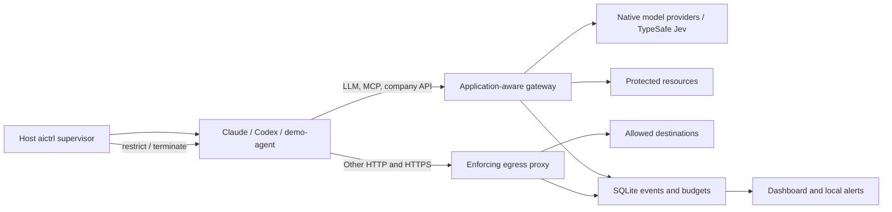

# AI Control Layer — real-agent MVP

## Approved T07 amendment (2026-10-04)

The user supplied the separate T07 specification after accepting T06 with real Codex compatibility deferred. T07 is authorized; stop before T08 and do not run or investigate real Codex. One implementing agent owns the work. Governance uses the existing protected SQLite database with additive tables and WAL/FULL durability. Exact request approval consumption and every applicable budget reservation must commit in one BEGIN IMMEDIATE transaction. Failed multi-budget validation preserves both counters and an approved record. Durable admission and dispatch intent precede the sole provider/backend call.

Policy configuration explicitly migrates 3→4/version t07; shared serialized contracts remain schema 1. Admission supports BLOCK > REQUIRE_APPROVAL > ALLOW; REDACT stays a guard decision. Budgets support session/agent/user/profile and requests/tokens/tool_calls/agent_steps, deterministic fixed windows and independent session lifetime runaway limits. Safe native token usage is settled when complete; unknown usage retains its reservation and subscription money remains unknown. Only the explicit trusted host CLI can grant approvals; the demonstration exercises that actual CLI for a task-authorized, exact counter-only synthetic operation.

Each protected operation captures one immutable policy/guard/threat-feed snapshot. A bounded background poll validates complete candidates before atomic publication; invalid policy/feed candidates independently retain the last good state. A separate schema-1 threat-feed.json supports literal and deliberately limited regex BLOCK signatures. The read-only protected config directory is gateway-only, so atomic host file replacement remains visible. Runtime wall-time/isolation/state leases are unchanged. Qualification includes offline SQLite concurrency, real Docker boundaries, one production MCP/Jev governance demo and exactly one final real Claude smoke. T08 dashboard/risk/alerts/restriction/termination are excluded. Current status/evidence belong to docs/T07_REPORT.md and NOTES.md; the T06 failure history remains intact.

T07 is COMPLETE: 435 offline tests, Docker 47/27/42 fully synthetic Codex checks, production governance/Jev 33/33 and real Claude exact reply/numeric settlement/cleanup. The first permitted Claude attempt was blocked before upstream by the initial 100000-token quota. After the quota correction to 256000 and offline regression, the user explicitly authorized exactly one additional attempt, which passed. Both results remain recorded; no automatic live retry is authorized. Real Codex was not attempted. Stop before T08 and await its separate specification. Earlier amendments below record their then-current boundaries.

## Approved T06 amendment

The user-authorized T06 specification replaces the original local Ollama/LiteLLM semantic-classifier choice with external TypeSafe Jev. The implemented fixed route is `https://api.typesafe.ai/v1/systemone`, model alias `jev-latest`, with three `noul` questions in one request. Deterministic secrets BLOCK and PII redaction run before any external semantic call; only provenance-marked untrusted tool results/resources are semantic subjects. The API key is staged by the host into an ephemeral 0400 file and mounted read-only into the gateway alone. A missing key or provider error blocks semantic-required operations. No Ollama, LiteLLM, alternate provider or production mock is installed.

The official pinned MCP Python SDK v2 supplies `/mcp` Streamable HTTP transport and the scripted stateless `demo-agent`; the gateway owns authorization and the synthetic protected memory. MCP events reuse the existing schema-1 `Channel.MCP` with `protocol=null`, so shared contracts do not change. Policy configuration migrates to schema 3/version `t06`. Native LLM forwarding retains its own protocols and guarded raw SSE units. These amendments supersede the corresponding reconnaissance choices below. T07 governance/reload and later reporting remain unimplemented; stop after T06 qualification.

At T06 closure, the user explicitly accepted proceeding with working Claude/Jev/MCP and deferred Codex's unresolved real-provider output-inspection regression. T06 is complete under that amended acceptance; Codex remains unqualified for this milestone and must not be presented as working. The user will provide T07 separately. Preserve the deferred issue and evidence in NOTES.md/TASKS.md/docs/T06_REPORT.md; no automatic Codex retry or next milestone.

## 1. Product scope and reuse

The MVP must run **Claude Code first**, with **Codex CLI as the second target and fallback**. A working real-agent integration is a release requirement.

Required commands:

```bash
aictrl run demo-agent <workspace>
aictrl run claude <workspace>
```

If Claude integration encounters an authentication or transport blocker, the required real-agent command becomes:

```bash
aictrl run codex <workspace>
```

Target both agents when Claude passes its integration checkpoint without unresolved compatibility issues. Keep their roles explicit:

| Runtime | Purpose |
|---|---|
| `demo-agent` | Deterministic security tests and the repeatable attack demonstration |
| Claude Code | Preferred proof that an existing coding agent works inside the product |
| Codex CLI | Second integration and fallback using the existing ChatGPT subscription |

Implementation remains owned by one agent. Plan for 18 hours of implementation, two hours of stabilization, and two hours of presentation preparation.

**Reuse `mattolson/agent-sandbox` directly at commit `c5b65e7cbd8f5b3bbf4e3ea40900c0014eedfa04`.** Adapt its agent Dockerfiles, Compose overlays, state mounts, proxy configuration, CA distribution, and startup/exec lifecycle. Preserve its MIT attribution and record modifications. Its source already installs Claude through the official installer and Codex through release binaries. [Claude image](https://github.com/mattolson/agent-sandbox/blob/c5b65e7cbd8f5b3bbf4e3ea40900c0014eedfa04/images/agents/claude/Dockerfile), [Codex image](https://github.com/mattolson/agent-sandbox/blob/c5b65e7cbd8f5b3bbf4e3ea40900c0014eedfa04/images/agents/codex/Dockerfile).

Retain the other reconnaissance decisions:

- FastAPI/Python modular monolith, SQLite, and a small server-rendered dashboard.
- mitmproxy for enforcing generic egress.
- External TypeSafe Jev for semantic control; native protocol forwarding for real agents (approved T06 amendment).
- MCP Python SDK for the tool gateway.
- Presidio with selected recognizers and no downloaded NLP model.
- No local semantic-model service in T06.
- Other researched gateways remain design references, avoiding additional service stacks.

## 2. Architecture and interfaces

**Agent adapters**

Introduce a configuration-oriented `AgentAdapter` interface:

```python
class AgentAdapter(Protocol):
    name: str
    image_ref: str
    entry_command: tuple[str, ...]
    persistent_state_volume: str | None
    state_mount: str | None
    environment: dict[str, str]
    required_provider_endpoints: tuple[ProviderEndpoint, ...]

    def render_config(self, session: AgentSession) -> AgentConfig: ...
    def smoke_command(self) -> tuple[str, ...]: ...
```

`ProviderEndpoint` distinguishes inference, authentication, and auxiliary traffic. Adapters supply provider configuration; the shared runtime owns isolation, lifecycle, identity, and enforcement.

| Adapter | Launch | Persistent state | Model protocol |
|---|---|---|---|
| `DemoAgentAdapter` | Official SDK scripted security client | None | MCP Streamable HTTP; no LLM |
| `ClaudeAdapter` | `claude` | `aictrl-claude-state` → `/home/dev/.claude` | Anthropic Messages |
| `CodexAdapter` | `codex --no-daemon` | `aictrl-codex-state` → `/home/dev/.codex` | Responses API |

Resolve and record the Claude installer version during preparation; pin the resulting image digest. Start Codex with the verified installed version, `0.159.3`. Use the upstream installation mechanisms rather than creating new installers.

**Authentication and state**

Authenticate Claude with the confirmed existing Claude subscription inside its dedicated volume. Authenticate Codex with the existing ChatGPT account through the container’s supported login flow.

- Never bind-mount host `~/.claude` or `~/.codex`.
- Provider authentication and native CLI history may persist in the corresponding named volume.
- Document that the agent can access its own provider authentication state. This is the explicitly accepted credential exception.
- GitHub, Kubernetes, database, company API, and gateway administrator credentials remain outside agent containers.
- Ordinary shutdown preserves authentication volumes. Credential deletion is a separate explicit operation.
- Allow one active container per provider state volume for the MVP.

The native clients manage their provider login and refresh. A custom OAuth bridge is unnecessary.

**Layered network architecture**



Agents join an internal Docker network. Only the gateway and proxy have upstream connectivity. The host supervisor alone controls Docker; neither the gateway nor the agent receives the Docker socket.

Adapt the upstream firewall rather than accepting its broad Docker-subnet allowance:

- Permit only the designated gateway and proxy addresses and ports.
- Block direct internet, host-service, sibling-container, external DNS, IPv6, and UDP bypasses.
- Resolve external destinations at the proxy; provide internal gateway/proxy names through controlled host entries.
- Establish networking before starting the CLI, then drop setup capabilities and privileges.
- Mount only the chosen workspace, provider state, and public CA material.
- Keep policies, enterprise secrets, audit storage, and the CA private key outside the workspace.
- Apply CPU, memory, PID, and wall-clock limits.

A trusted bootstrap performs setup; the agent runs without network-administration capabilities. Native CLI permission prompts may remain enabled, but Docker and the gateways provide the security boundary.

**HTTPS inspection modes**

Every event records its inspection level:

| Traffic | Enforcement |
|---|---|
| Known LLM/MCP/company API | Explicit gateway; structured payload inspection |
| Generic HTTP | Destination, method, path, and configured safe metadata |
| Generic HTTPS with trusted interception | Destination, method, path, and configured safe metadata |
| Generic HTTPS with opaque TLS | CONNECT destination and port only |

Distribute only the public proxy CA to agents. Keep the CA private key exclusively in proxy storage. Claude supports proxy variables and custom CA configuration. [Claude network configuration](https://code.claude.com/docs/en/network-config).

For pinned or incompatible generic clients, configure a destination-only tunnel exception and reconnect. Do not silently downgrade after a TLS failure. A policy requiring path or content inspection must fail closed when that inspection is unavailable. Protected model and resource endpoints cannot obtain an opaque bypass around their application gateway. mitmproxy supports destination-specific interception exceptions. [mitmproxy interception exceptions](https://docs.mitmproxy.org/stable/howto/ignore-domains/).

**Claude integration**

Generate the following runtime configuration:

```text
CLAUDE_CONFIG_DIR=/home/dev/.claude
ANTHROPIC_BASE_URL=http://gateway:8000/anthropic
HTTP_PROXY=http://proxy:8080
HTTPS_PROXY=http://proxy:8080
NO_PROXY=gateway,localhost,127.0.0.1
NODE_EXTRA_CA_CERTS=/etc/aictrl/proxy-ca.pem
CLAUDE_CODE_DISABLE_NONESSENTIAL_TRAFFIC=1
ANTHROPIC_CUSTOM_HEADERS=X-AICtrl-Session: <session-token>
```

Do not set `ANTHROPIC_API_KEY`, `ANTHROPIC_AUTH_TOKEN`, or `apiKeyHelper` for the subscription configuration. Setting only `ANTHROPIC_BASE_URL` retains the saved subscription authentication. [Claude subscription routing](https://code.claude.com/docs/en/llm-gateway#subscriptions-and-gateways).

Serve `/anthropic/v1/messages`, including query parameters, and `/anthropic/v1/messages/count_tokens`. Forward to the fixed Anthropic upstream, preserving provider authentication, `anthropic-version`, `anthropic-beta`, tool identifiers, supported body fields, streaming events, and usage information. Strip the internal session header before forwarding. [Claude gateway protocol](https://code.claude.com/docs/en/llm-gateway-protocol).

Use native HTTP forwarding through HTTPX, avoiding protocol translation for this path.

**Codex integration**

Configure a custom Responses provider pointing to `/codex` on the gateway, with `requires_openai_auth=true`, WebSockets disabled, and an internal session header separate from provider authorization.

Forward `/codex/responses` to the pinned client’s ChatGPT Codex backend. Preserve authentication/account headers, function calls, matching results, replayed conversation input, usage, and terminal SSE events. Use a model recognized by the pinned CLI; do not introduce a custom model alias.

Codex compatibility requires a complete Responses conversation and tool loop; chat-completions support alone is insufficient. [Codex gateway requirements](https://learn.chatgpt.com/docs/enterprise/gateway-compatibility).

**Application enforcement and streaming**

The shared pipeline is:

```text
LLM:
identity → policy → input guards → budget reservation → durable admission
→ provider → output guards → usage settlement → final audit event

MCP:
identity → tool/resource authorization → argument guards → approval if required
→ budget reservation → tool call → result guards → audit

Generic egress:
identity → destination/port → available HTTP metadata → allow/block → audit

Blocked request:
no upstream action → safe reason → audit → risk update → alert evaluation

Escalation:
threshold reached → persist alert → restrict/terminate through host supervisor
→ record completed response action
```

Streaming support is mandatory for real agents. Preserve protocol ordering, keepalives, errors, and completion markers. Buffer individual content blocks and complete tool arguments until their required output checks pass; impose size and time limits. This deliberately adds guard latency and may delay a single text block. Do not release unchecked tool arguments or claim that already-delivered content can be recalled.

Keep the existing contracts—`AgentSession`, `PolicyContext`, `ControlRequest`, `ControlDecision`, `SecurityEvent`, `BudgetState`, `RiskState`, `Alert`, and `ThreatSignature`—and add adapter identity, protocol, inspection level, and billing mode where relevant.

**Policy, reporting, and governance**

Use one validated YAML policy and a separate reloadable JSON threat feed. Configuration covers:

```yaml
default_action: BLOCK

agents:
  claude:
    enabled: true
    auth_mode: subscription
  codex:
    enabled: true
    auth_mode: subscription

guards:
  secrets: BLOCK
  pii: REDACT
  semantic:
    enabled: true
    on_error: BLOCK

budgets:
  requests_per_minute: 60
  tokens: 100000
  tool_calls: 40
  agent_steps: 60
  wall_time_seconds: 600

response:
  high: restrict
  critical: terminate
```

The complete policy also contains explicit model, tool, resource, destination, TLS-mode, profile, risk-weight, and alert rules. Unknown fields or invalid references reject a candidate configuration.

- Atomically replace validated snapshots on reload; retain the last valid configuration after an invalid edit.
- Keep ALLOW, BLOCK, REDACT, REQUIRE_APPROVAL, and AUDIT actions.
- Filter MCP tool discovery and independently authorize calls.
- Implement project versus private-memory namespace access.
- Use deterministic secret/signature/PII checks first, followed by external Jev checks for relevant untrusted text (approved T06 amendment).
- Reserve and settle budgets atomically in SQLite. Use fixed windows and simple counters across session, agent, user, and profile; defer distributed and rollover behavior.
- Define “agent steps” as observable gateway/tool activity, not hidden model reasoning.
- Keep approval handling to request binding, expiry, one-time use, and policy recheck at execution.
- Store safe structured events without raw credentials or full prompts. Drive counters and dashboard updates from durable events.
- Show explainable risk contributions and threshold/window alerts. Persist alerts and support a local webhook with simple bounded retry.
- Restrict access immediately at the gateway and have the host supervisor disconnect or stop the affected sandbox.

Dashboard views remain Overview, Sessions, Events, Policies, Budgets, and Alerts, with JSONL/CSV export and separate deterministic, semantic, upstream, and total latency measurements.

## 3. Milestones and TASKS.md backlog

Create the planning records first: `REUSE_DECISIONS.md`, `OPEN_SOURCE.md`, `ARCHITECTURE.md`, `AGENTS.md`, `NOTES.md`, and `TASKS.md`. Record the upstream commit, adapted files, licenses, and actual image/CLI versions.

Organize implementation under:

```text
src/aictrl/
  adapters/
  cli/
  runtime/
  gateway/
  policy/
  guards/
  governance/
  reporting/
  dashboard/
docker/
config/
demo/
tests/
docs/
```

`TASKS.md` uses one owner, dependency IDs, status, acceptance criteria, and affected modules. The ordered backlog is:

| Task | Hours | Dependencies | Acceptance |
|---|---:|---|---|
| T01 — Contracts, reused assets, images, authentication | 0–0.5 | None | Adapter contract established; pinned images preparing; Claude login started in its volume |
| T02 — Launcher and isolation | 0.5–1.25 | T01 | Real CLI starts through adapted Compose lifecycle; workspace and named state volume attached; enforcing proxy reachable |
| T03 — First native gateway path | 1.25–2.25 | T02 | Claude subscription receives a real model response through the gateway; policy and SQLite events work |
| T04 — Required integration proof | 2.25–3 | T03 | Allowed request succeeds, denied request fails, direct bypass fails, events identify the real-agent session |
| T05 — Second adapter or fallback completion | 3–4 | T04 | Timeboxed Codex integration when Claude is healthy; otherwise complete the selected real-agent path first |
| T06 — Guards and MCP | 4–8 | T04 | Secrets, PII, semantic checks, output checks, native tool loop, filtered tools, and protected memory |
| T07 — Governance and reload | 8–11 | T06 | Budgets, simple approvals, policy/feed reload, and runaway limits |
| T08 — Reporting and response | 11–14 | T07 | Dashboard, counters, latency, explainable risk, local alerts, restriction/termination |
| T09 — Full verification | 14–18 | T06–T08 | Judge suite, real-agent qualification, failure tests, documentation, and offline preparation |
| T10 — Stabilization | 18–20 | T09 | Clean-start rehearsal; fix failures; freeze features |
| T11 — Submission | 20–22 | T10 | Rehearsed demo and maximum ten-slide PDF |

**Hour-3 checkpoint**

Demonstrate one of:

```bash
aictrl run claude .
aictrl run codex .
```

Required evidence:

1. The actual CLI starts and receives a real provider response.
2. A simple workspace tool operation completes.
3. An allowed HTTP request succeeds from that sandbox.
4. A forbidden destination and a direct-network bypass fail from that sandbox.
5. Corresponding events appear in the platform’s event view.

Use deterministic network probes inside the same container, so this checkpoint does not depend on persuading the model to attempt an attack.

If Claude authentication is not usable by approximately hour 1, start the Codex fallback. If Claude has an unresolved transport blocker by hour 2, prioritize Codex for the checkpoint. Once one agent passes, spend at most one additional hour on the second before returning to mandatory controls.

Browser approval UI, policy history, OpenTelemetry, advanced webhook delivery, distributed quotas, and sophisticated approval invalidation remain outside the critical path.

## 4. Verification and demonstration

`make prepare` downloads and pins runtime images and Python dependencies. T06 uses external Jev and has no local model download; dashboard preparation remains later work. `make test` runs the offline suite, including explicitly fake semantic providers, after documented preparation. Live Jev qualification is separately invoked with `make verify-jev`.

| Area | Required scenarios |
|---|---|
| Adapter/runtime | Correct command, environment, image, state mount, exit status, signal handling, and restart persistence |
| Credentials | No host agent-directory mounts; no enterprise credentials or CA private key in the agent; provider credentials absent from platform logs |
| Networking | Allowed/blocked hosts; direct IP, DNS, IPv6, UDP, host, and sibling bypass attempts; proxy-variable removal |
| HTTPS modes | Intercepted method/path enforcement; explicitly opaque destination enforcement; no silent inspection downgrade |
| Native protocol | SSE completion, follow-up turn, tool/result loop, usage, errors, and secret split across streaming chunks |
| Guards | Allowed text, secrets, PII redaction/blocking, direct and indirect injection, input and output findings |
| MCP/resources | Discovery filtering, guessed forbidden tool, approval-required operation, allowed/denied memory namespace |
| Governance | Below/above budgets, concurrent reservation, loop limit, wall time, restriction, and termination |
| Reload | Valid policy change, invalid policy retention, new threat signature, malformed feed retention |
| Reporting | Audit, counters, risk contribution, alert threshold/cooldown, exports, and latency |
| Recovery | Model unavailable, upstream failure, audit/budget failure, alert transport failure, legitimate traffic still permitted |

Tests use explicitly deterministic provider/classifier fixtures with no live calls. The separate `make verify-jev` sends two fixed synthetic examples to the real external provider only when a host key is configured. Native protocol tests use synthetic streams without paid services.

A separate `make verify-agents` performs live qualification against configured subscriptions. Submission requires a successful recorded run for at least one real agent. Offline tests passing alone cannot satisfy that requirement.

**Four-minute demo**

1. **Real-agent proof:** launch Claude Code, obtain a model response, read the demo workspace, and use an allowed gateway tool.
2. **Boundary proof:** run allowed and denied network probes in that session; show the resulting events and inspection levels.
3. **Deterministic attack sequence:** run `demo-agent` through indirect injection, forbidden memory/tool access, secret leakage, and blocked exfiltration.
4. **Operational response:** show risk accumulation, the local alert, and session restriction or termination.
5. **Adaptability:** edit policy and threat feed, repeat the fixture, and show immediate enforcement changes.
6. **Evidence:** show budget enforcement, latency, and the judge-suite result.

Clearly identify the real-agent session and scripted attack session. Do not represent a scripted fixture as behavior produced by Claude or Codex.

## 5. Risks, defaults, and Definition of Done

| Risk | Planned response |
|---|---|
| Claude subscription login or routing fails | Use Codex with the existing ChatGPT account; keep the same adapter/runtime boundary |
| Provider outage during judging | Show previously recorded live qualification and run the local demonstration; disclose the outage |
| TLS interception fails | Use an explicit destination-only exception for eligible generic traffic; sensitive inspection-required routes stay closed |
| Streaming compatibility breaks | Preserve native protocol and headers; reduce optional client features; test the pinned CLI before adding features |
| Local semantic model is slow | Preload and warm it, bound input/output, report measured latency, and retain fail-closed behavior where required |
| Subscription cost cannot be determined | Report tokens and subscription billing mode; leave actual monetary cost unknown. Demonstrate monetary limits with a clearly labeled configured test tariff |
| Authentication state is read by the agent | Document the accepted provider-state exception; retain enterprise credentials outside the sandbox |
| Scope threatens the milestone | Cut secondary UI and enterprise features first; keep one real agent and deterministic tests mandatory |

Invalid initial configuration prevents readiness. Invalid reloads retain the last valid snapshot. Audit or budget-store failures block protected operations. Alert-delivery failure does not undo enforcement. Upstream write operations are not automatically retried.

The desktop browser remains outside scope. Filesystem isolation protects unmounted host resources; the MVP does not claim comprehensive auditing of every local file operation or arbitrary HTTPS body inspection.

**Definition of Done**

- `demo-agent` and at least one actual Claude/Codex CLI run through `aictrl`.
- The real agent completes a model response and tool loop through the application gateway.
- Allowed traffic succeeds; forbidden and bypass traffic fails with attributable events.
- Dedicated provider-state volumes work without host agent-directory mounts.
- Enterprise credentials remain outside agent containers.
- Guards, budgets, MCP authorization, memory rules, reloadable feeds, reporting, risk, alerts, and automatic response are demonstrated and tested.
- HTTPS inspection coverage is explicit in policy, events, dashboard, and documentation.
- The offline judge suite passes, and at least one live real-agent qualification is recorded.
- README, reuse/license records, architecture, task status, limitations, demo instructions, and submission materials reflect the implemented system.
- The presentation is at most ten slides and the live demonstration fits three to five minutes.
